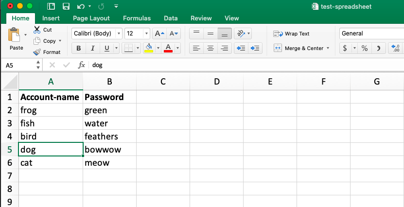

# getpass

Command-line password manager written in Python

## Features:

### Version 1
* Copies password of specified account from file to paste buffer

## Data file
To run this program you will need a valid password file in CSV format. 

To be valid, the file must contain the account names in Column A, under the header **Account-name** and passwords in Column B, under the header **Password**. See image of sample file below. 



## Command line usage:
```
python3 getpass.py <account_name1>   # returns password for <account_name> in paste buffer
```